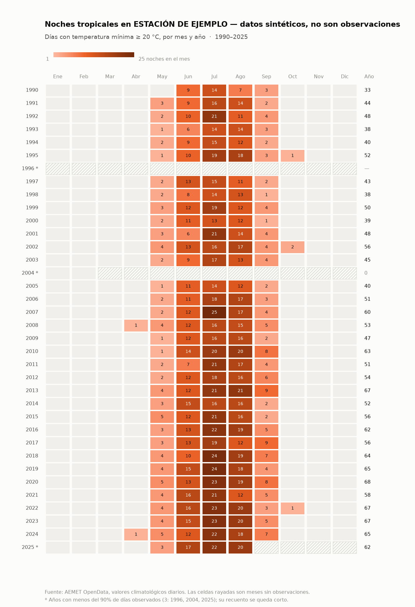

# Clima de Castelló a partir de AEMET

Descarga los valores climatológicos diarios de una estación de
[AEMET OpenData](https://opendata.aemet.es/) y saca de ahí cuatro lecturas del
mismo dato: cuántas noches pasan de un umbral, cuánto se desvía cada mes de lo
normal, cómo va el año frente a todos los anteriores, y qué días son los más
extremos de la serie.

Funciona solo en GitHub: una tirada mensual manda los gráficos por Telegram y
una vigilancia diaria avisa si cae un récord. También se puede usar a mano
desde la línea de comandos.



> Esa imagen está hecha con **datos sintéticos**, solo para enseñar el formato.
> Los resultados reales de Castelló están en [`resultados/`](resultados/).

## Índice

- [Qué produce](#qué-produce)
- [Automatización en GitHub](#automatización-en-github)
- [Uso desde la línea de comandos](#uso-desde-la-línea-de-comandos)
- [Decisiones metodológicas](#decisiones-metodológicas)
- [Estructura del repo](#estructura-del-repo)

## Qué produce

| Salida | Qué contesta | Dónde |
|---|---|---|
| **Mapa de recuento** | ¿Cuántas noches al año pasan de 20 °C? | `resultados/min20/`, `min25/`, `tmax35/` |
| **Mapa de anomalías** | ¿Está subiendo la temperatura? | `resultados/anomalias_tmin/`, `anomalias_tmax/` |
| **Gráfico de líneas** | ¿Cómo va este año frente a todos los anteriores? | `resultados/lineas_tmin/`, `lineas_tmax/` |
| **Tabla de extremos** | ¿Cuáles son los días más cálidos del registro? | `resultados/rankings/` |

Cada carpeta lleva el CSV con los números, un `resumen.txt` y las imágenes en
tema claro y oscuro.

### Mapa de recuento

Filas = años, columnas = meses, color = cuántos días de ese mes superaron el
umbral, y el total del año en la columna de la derecha (en negro, porque es
otra escala y no debe compartir el color). Los meses sin observaciones salen
rayados y los años con menos del 90 % de días observados van con asterisco.

Umbrales con nombre propio: **20 °C = noche tropical**, **25 °C = noche
tórrida** (criterio OMM). Cualquier otro sale descrito literalmente.

### Mapa de anomalías

Contar días por encima de un listón depende mucho de dónde pongas el listón y
descarta la mayoría de los datos. Este mapa usa todos los días: compara la
media de cada mes con **su normal climática de 1991-2020** (el periodo de
referencia de la OMM). Escala divergente con gris en el cero, azul por debajo
y rojo por encima. A la derecha, la media del año y el récord absoluto.

### Gráfico de líneas

Un año por línea: el pasado en gris, la normal en trazo discontinuo y los años
que elijas en color. Tres resoluciones:

- **diaria** (365 puntos): el detalle de cada ola de calor, pero con dos años
  destacados las líneas se cruzan tanto que no se lee cuál va por arriba;
- **diaria suavizada** (`--suavizado 7`): la que se publica, mantiene los
  episodios y se puede seguir;
- **mensual** (12 puntos): la más limpia para leer tendencia.

### Tabla de extremos

Los diez días con la mínima (o la máxima) más alta de todo el registro. Los
empates en el último puesto entran todos, y las filas del año más reciente van
resaltadas. Sin barras: en una lista cuyos valores caben en un grado, una
barra que no arranca en cero exagera diferencias de una décima.

## Automatización en GitHub

### Puesta en marcha (una sola vez)

Tres secretos en **Settings → Secrets and variables → Actions**:

| Secreto | De dónde sale |
|---|---|
| `AEMET_API_KEY` | gratis en [opendata.aemet.es](https://opendata.aemet.es/centrodedescargas/altaUsuario) |
| `TELEGRAM_BOT_TOKEN` | [@BotFather](https://t.me/BotFather) → `/newbot` |
| `TELEGRAM_CHAT_ID` | escríbele a tu bot y mira `chat.id` en `https://api.telegram.org/bot<TOKEN>/getUpdates` |

El chat id no es una credencial: vale igual puesto en la pestaña *Variables*.
Y hay que **darle a Start al bot** antes: Telegram no deja que un bot inicie
una conversación.

### `mapa-calor.yml` — informe mensual

Corre **el día 6 de cada mes** (y a mano desde *Run workflow*). El día 6 y no
el 3 por el desfase de la fuente: AEMET publica con unos tres días de retraso,
así que el día 3 el mes anterior llegaría justo o a medias. Si aun así falta
algún día por publicar, el mensaje lo avisa en vez de callarlo. Ejecuta
`scripts/generar_lote.sh`, que genera el juego completo, lo commitea en
`resultados/` y manda seis gráficos por Telegram: la media móvil de 7 días,
los mapas de tropicales, tórridas y días de 35, y las anomalías de mínimas y
máximas.

Desde el formulario se cambian estación, años, variable, umbral, firma, años a
destacar y si se envía o no.

### `vigilancia.yml` — récords, a diario

Corre **todos los días a las 6:40 UTC**, en dos trabajos paralelos: uno vigila
las mínimas y otro las máximas. Cada uno actualiza los datos, recalcula su top
10 y lo compara con el que había guardado. **Solo si aparece una fecha que
antes no estaba** manda la tabla por Telegram y commitea el ranking nuevo. Si
no hay novedad, ni escribe ni commitea.

El aviso distingue la magnitud: «🔴 Récord absoluto» si entra en el número
uno, «Nueva entrada (puesto N)» si entra más abajo, y lista varias si caen de
golpe.

Dos límites que conviene tener presentes:

- **AEMET publica los valores diarios con unos días de retraso**, porque pasan
  validación —a 19 de agosto de 2026 iba **tres días** por detrás—. El aviso
  llega cuando el dato es firme, no la misma noche. Cada mensaje dice hasta
  qué día hay datos publicados, para poder distinguir «no ha habido récord»
  de «el día del récord todavía no está publicado».
- Sin ranking anterior con el que comparar no se avisa de nada: la primera
  tirada crea la base y calla, en vez de anunciar doce récords de golpe.

Con `forzar_envio` manda la tabla aunque no haya novedades, para probar.

> GitHub solo lanza los `cron` desde la rama por defecto del repositorio. Si
> algún día mueves esto a otra rama, los dos workflows se quedan mudos.

## Uso desde la línea de comandos

```bash
python -m venv .venv && source .venv/bin/activate
pip install -r requirements.txt
export AEMET_API_KEY="eyJhbGciOi..."   # o el fichero .aemet_api_key
```

```bash
# ¿qué estaciones hay en la provincia?
python -m aemet_noches estaciones --provincia CASTELLON

# descargar (se cachea en datos/crudos/ y se puede reanudar)
python -m aemet_noches descargar --estacion 8500A --desde 1990

# los cuatro productos
python -m aemet_noches calcular  --umbral 20                 # recuento → CSV
python -m aemet_noches mapa      --umbral 20 --tema claro    # mapa de calor
python -m aemet_noches anomalias --variable tmax             # anomalías
python -m aemet_noches lineas    --variable tmax --suavizado 7 --destacar 2025 2026
python -m aemet_noches extremos  --variable tmin --top 10 --png tabla.png

# o todo el lote de una vez, como hace la tirada mensual
ESTACION=8500A DESDE=1990 ./scripts/generar_lote.sh
```

Opciones que se repiten en varios comandos:

| Opción | Para qué |
|---|---|
| `--variable tmax` | la máxima del día en vez de la mínima |
| `--umbral 25` | otro listón |
| `--estricto` | cuenta `> umbral` en vez de `>= umbral` |
| `--temas claro oscuro` | genera los dos temas de una vez |
| `--credito "..."` | firma al pie |
| `--referencia 1961-1990` | otro periodo normal |
| `--espera 3` | más pausa entre peticiones si AEMET corta por ritmo |

## Decisiones metodológicas

**≥ o >.** «Noche tropical» es *mínima ≥ 20,0 °C* (OMM y AEMET), y es lo que
hace por defecto. «Superior a 20» en sentido literal sería `> 20`, que deja
fuera los días de mínima exactamente 20,0: eso es `--estricto`. Di siempre
cuál usas.

**Los huecos son la trampa principal.** Un año al que le faltan observaciones
tiene un recuento corto y parece un año fresco. Por eso el CSV lleva
`dias_con_dato` y `cobertura`, los meses sin datos salen rayados, y para las
medias mensuales un mes con menos del 90 % de días observados **no se calcula**
en vez de calcularse mal.

**La normal es 1991-2020, y ya es un periodo caliente.** El cero del mapa de
anomalías no es «el clima de antes»: son treinta años que ya llevaban
calentamiento dentro. Por eso los noventa salen en torno a −1 y los últimos
años en torno a +1. Con referencia 1961-1990 el rojo sería más intenso; el
gráfico se queda corto, nunca exagera.

**La serie no está homogeneizada.** Los observatorios se mudan, cambian de
instrumental y su entorno se urbaniza. Esto cuenta lo que midió el termómetro.
Parte de la subida es clima y parte es entorno, y con estos datos no se pueden
separar.

**El tramo en curso siempre se vuelve a descargar.** Un tramo que llega hasta
hoy está incompleto por definición; darlo por bueno congelaría la serie en el
día en que se cacheó por primera vez.

## Estructura del repo

```
aemet_noches/       api.py (cliente) · datos.py (lectura) ·
                    metricas.py (cálculo) · grafico.py (dibujo) · cli.py
scripts/            generar_lote.sh · telegram.py · vigilar_top.py
.github/workflows/  mapa-calor.yml (mensual) · vigilancia.yml (diario)
resultados/         lo que generan las tiradas, por producto
docs/               ejemplo con datos sintéticos y su generador
tests/              48 pruebas, ninguna toca la red
```

```bash
pip install pytest && python -m pytest tests -q
```

Las pruebas cubren el recuento y los umbrales, la coma decimal y las marcas de
AEMET (`Ip`), la cobertura, el troceado de fechas y el refresco del tramo
abierto, las anomalías y su periodo de referencia, los empates del ranking, el
troceado de envíos a Telegram y la detección de entradas nuevas. Los dibujos
llevan pruebas de humo en los dos temas.
